<!-- ============================== HEADER ============================== -->
<p align="center">
  
</p>

<p align="center">
  <a href="https://github.com/Anshkanungo">
    
  </a>
</p>

<p align="center">
  <a href="https://linkedin.com/in/anshkanungo"></a>
  <a href="mailto:anshkanungo17@gmail.com"></a>
  <a href="https://anshk-refresh-portfolio.vercel.app"></a>
  
</p>

---

### `> whoami`

```python
class AnshKanungo:
    role       = "Data Engineer Intern @ Elevare Health (Clinical AI for maternal health)"
    education  = "MS Computer Science @ Northeastern University, Khoury College (4.0 GPA)"
    location   = "Boston, MA"

    building   = ["wearable data ingestion pipelines", "neural models on longitudinal biosignals"]
    researched = ["eBPF probe placement in MongoDB WiredTiger", "LLM-driven performance anomaly analysis"]
    interests  = ["data engineering", "RAG & retrieval", "multimodal ML", "MLOps"]

    def fun_fact(self):
        return {"hobby": "violin 🎻", "fav_piece": "Mendelssohn Violin Concerto in E minor, Op. 64"}  # 🎧 listen below
```

<p align="center">🎻 <b>Off the keyboard:</b> I play the violin. Favorite piece: <a href="https://www.youtube.com/watch?v=zlRRdGnzA00&t=2510s"><b>Mendelssohn Violin Concerto in E minor, Op. 64</b></a></p>

---

### 🛰️ Experience

| | Role | What I did |
|:-:|---|---|
| 🩺 | **Data Engineer Intern** · Elevare Health<br><sub>Sep 2026 – Present</sub> | Wearable ingestion pipeline (Whoop → Junction) into deduplicated longitudinal patient records; SageMaker model emitting tiered alerts over HRV, RHR & sleep signals |
| 🔬 | **Graduate Research Assistant** · Northeastern<br><sub>Sep 2025 – Aug 2026 · $7.5K scholarship</sub> | Algorithm for optimal eBPF/uprobe instrumentation placement in MongoDB WiredTiger under a probe budget; LLM analysis of flame graphs & stack traces |
| ✈️ | **AI Engineer Intern** · WebEarl Technologies<br><sub>Jan 2025 – Apr 2025</sub> | Multimodal listings pipeline + embedding retrieval: **95%** recommendation relevance, **−40%** latency with Redis caching |
| 💹 | **Data Scientist Intern** · GIFT City<br><sub>Jun 2024 – Aug 2024</sub> | RAG over 8+ financial DBs (**88%** retrieval accuracy, <100 ms); NL→SQL chatbot across 50+ tables, **−60%** analyst work |

---

### 🚀 Featured Projects

<table>
  <tr>
    <td width="50%" valign="top">
      <h4><a href="https://github.com/Anshkanungo/ad-intelligence">🎯 Ad Intelligence Pipeline</a></h4>
      Multimodal pipeline that pulls brand, product, tagline &amp; audience out of video/image ads with a VLM. CLIP-based frame selection took it from <b>413s → 31s (13×)</b> and cut GPU compute by <b>95%</b>.<br><br>
        
    </td>
    <td width="50%" valign="top">
      <h4><a href="https://github.com/Anshkanungo/NUtrition">🏆 NUtrition</a></h4>
      <b>Won Hack NUACM (Tech).</b> Semantic food search over <b>2M+ products</b> from OpenFoodFacts with Gemini-powered natural language queries and barcode scanning, served by FastAPI at 50 req/s.<br><br>
        
    </td>
  </tr>
  <tr>
    <td width="50%" valign="top">
      <h4><a href="https://github.com/Anshkanungo/FairSearch">⚖️ FairSearch</a></h4>
      Do dense retrievers over-represent papers from elite institutions? Measures <b>institutional bias in academic RAG</b> over arXiv and mitigates it with a fair re-ranking algorithm.<br><br>
       
    </td>
    <td width="50%" valign="top">
      <h4><a href="https://github.com/Anshkanungo/PipedPiper">🤖 PipedPiper</a></h4>
      Agentic travel orchestrator that lives in Slack. A Llama-3.3-70B lead agent routes multilingual intent to a fast transactional model to build structured itineraries.<br><br>
       
    </td>
  </tr>
</table>

---

### 🧰 Tech Stack

<p align="center">
  <b>Languages</b><br><br>
  
</p>

<p align="center">
  <b>ML &amp; AI</b><br><br>
  <br>
  
  
  
  
</p>

<p align="center">
  <b>Data, Cloud &amp; Systems</b><br><br>
  <br>
  
  
  
</p>

<p align="center">
  <b>Databases</b><br><br>
  
  
</p>

---

### 📊 GitHub Stats

<p align="center">
  
</p>
<p align="center">
  
  
</p>
<p align="center">
  
</p>

<p align="center">
  <picture>
    <source media="(prefers-color-scheme: dark)" srcset="https://raw.githubusercontent.com/Anshkanungo/Anshkanungo/output/github-snake-dark.svg" />
    <source media="(prefers-color-scheme: light)" srcset="https://raw.githubusercontent.com/Anshkanungo/Anshkanungo/output/github-snake.svg" />
    
  </picture>
</p>

<!-- ============================== FOOTER ============================== -->
<p align="center">
  
</p>
